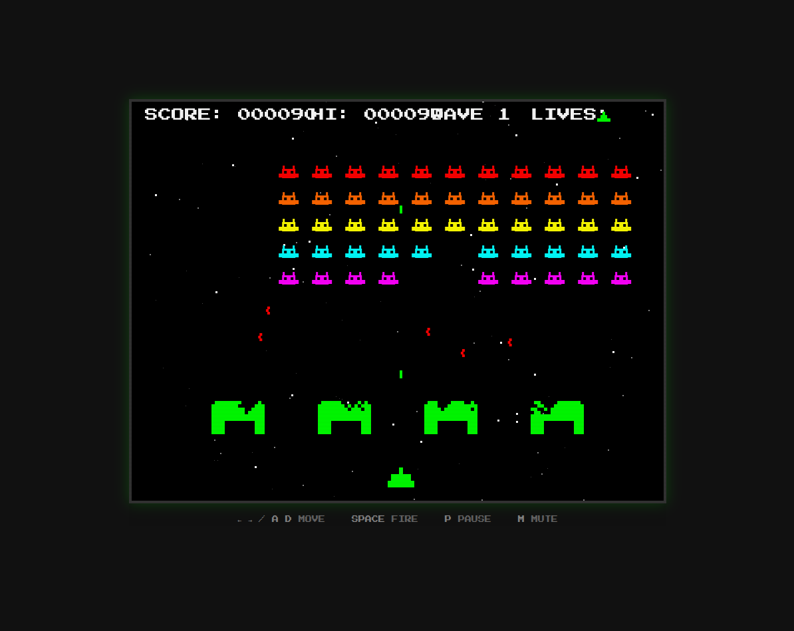

# Retro Arcade Game 🚀👾

A classic **Space Invaders** clone built with vanilla JavaScript and HTML5 Canvas. Features retro pixel-art graphics, 8-bit synthesized sound effects, and smooth 60 FPS gameplay.

> 🤖 **Scaffolded with [goose](https://github.com/block/goose)** using Claude Code's lead/worker multi-agent pattern and the [AGENTS.md](https://agents.md/) standard.



## 🎮 Play Now

```bash
# Install dependencies
npm install

# Start development server
npm run dev

# Open http://localhost:3000
```

## ✨ Features

### Gameplay
- 🕹️ **Classic Mode**: Authentic Space Invaders mechanics with 5 levels
- ♾️ **Endless Mode**: Infinite waves with progressive difficulty scaling
- 🏆 **Leaderboard**: Top 10 high scores with classic 3-letter initials entry
- 🎮 **Controller Support**: Full gamepad support (Xbox, PlayStation, Nintendo, generic)

### Audio & Visuals
- 🎨 **Retro Graphics**: Pixel-art style with CRT scanline effect
- 🌟 **Parallax Starfield**: 3-layer scrolling background with depth effect
- 🔊 **8-Bit Audio**: Synthesized sound effects using Web Audio API
- 📳 **Haptic Feedback**: Controller vibration on shoot and hit events

### Technical
- 💾 **Persistent Storage**: Separate leaderboards for Classic and Endless modes
- 📱 **Responsive**: Scales to different screen sizes
- ⚡ **60 FPS**: Smooth gameplay with fixed timestep loop

## 🎯 Controls

### Keyboard

| Key | Action |
|-----|--------|
| `←` / `A` | Move left |
| `→` / `D` | Move right |
| `↑` / `W` | Navigate up (menus, name entry) |
| `↓` / `S` | Navigate down (menus, name entry) |
| `Space` / `Enter` | Fire / Confirm |
| `P` | Pause |
| `M` | Mute/Unmute |
| `R` | Restart (game over) |

> **Name Entry**: Type letters directly or use Up/Down arrows to cycle through characters

### Controller (Gamepad)

| Button | Action |
|--------|--------|
| D-Pad Left / Left Stick | Move left |
| D-Pad Right / Left Stick | Move right |
| D-Pad Up/Down | Navigate menus, name entry |
| A / RB / RT | Fire / Confirm |
| Start | Pause |
| Select | Restart (game over) |
| Y | Mute/Unmute |

**Supported Controllers:**
- Xbox (One, Series X/S, 360)
- PlayStation (DualShock 4, DualSense)
- Nintendo Switch Pro Controller
- 8BitDo controllers
- Generic USB/Bluetooth gamepads

> **Note**: Controller status is shown on the title screen and in-game (icon in bottom-right corner when connected)

## 📊 Scoring

| Enemy Type | Points |
|------------|--------|
| Bottom rows (1-2) | 10 |
| Middle rows (3-4) | 20 |
| Top row (5) | 30 |
| Mystery Ship | 50-300 (random) |

**Bonus**: Extra life every 10,000 points!

## 🎲 Game Modes

### Classic Mode
The original Space Invaders experience with 5 levels of increasing difficulty.

- Complete all waves to finish the game
- Difficulty increases each level
- Score saved to Classic Mode leaderboard

### Endless Mode ♾️
Survive as long as possible against infinite waves!

| Wave | Difficulty Changes |
|------|-------------------|
| Every wave | Speed +5% (caps at 3x) |
| Every wave | Enemy fire rate +3% (caps at 2.5x) |
| Wave 10+ | "WARNING" indicator |
| Wave 15+ | "DANGER" indicator |

- No level cap - keeps getting harder!
- Wave count displayed in HUD
- Separate leaderboard from Classic Mode
- Mystery ships spawn more frequently at higher waves

### High Score Entry
When you achieve a top 10 score, enter your initials arcade-style:

```
═══════════════════════════
   N E W   H I G H   S C O R E
        12,500 PTS

        [ A ] [ A ] [ A ]
              ▲
    ↑/↓ CHANGE   ←/→ MOVE
       ENTER TO CONFIRM
═══════════════════════════
```

- 3 characters (A-Z, 0-9, space)
- Use arrow keys or type directly
- Top 5 scores shown on title screen

## 🏗️ Project Structure

```
retro-arcade-game/
├── AGENTS.md                    # AI agent instructions
├── .claude/agents/              # Subagent definitions
│   ├── game-engine.md
│   ├── renderer.md
│   ├── entity.md
│   ├── audio.md
│   ├── controller.md            # Gamepad support
│   ├── test-writer.md
│   └── docs-writer.md
├── src/
│   ├── main.js                  # Entry point
│   ├── game.js                  # Main game loop
│   ├── constants.js             # Configuration
│   ├── entities/                # Game objects
│   ├── managers/                # Systems
│   ├── renderer/                # Drawing
│   ├── audio/                   # Sound
│   └── utils/                   # Helpers
├── tests/                       # Unit tests
├── assets/                      # Sprites & sounds
└── docs/                        # Documentation
```

## 🛠️ Development

### Prerequisites

- Node.js 18+
- npm 9+

### Commands

```bash
# Development
npm run dev          # Start dev server with hot reload

# Testing
npm test             # Run tests in watch mode
npm run test:run     # Run tests once
npm run test:coverage # Run with coverage report

# Building
npm run build        # Production build
npm run build:gh-pages # Build for GitHub Pages
npm run preview      # Preview production build

# Deployment
npm run deploy       # Deploy to GitHub Pages (manual)

# Linting
npm run lint         # Check code style
npm run lint:fix     # Fix auto-fixable issues
```

## 🚀 Deployment to GitHub Pages

### Option 1: Automatic Deployment (Recommended)

The project includes a GitHub Actions workflow that automatically deploys to GitHub Pages on every push to `main`.

**Setup steps:**

1. Push your code to GitHub
2. Go to your repository **Settings** → **Pages**
3. Under **Source**, select **GitHub Actions**
4. Push to `main` branch - deployment happens automatically!

Your game will be live at: `https://your-username.github.io/retro-arcade-game/`

### Option 2: Manual Deployment

```bash
# Build and deploy to gh-pages branch
npm run deploy
```

**Note:** Before deploying, update the repository name in `vite.config.js` if your repo has a different name:

```javascript
// vite.config.js
base: process.env.GITHUB_PAGES ? '/your-repo-name/' : '/',
```

### Option 3: Other Static Hosts

The production build works with any static hosting service:

```bash
# Build for production
npm run build

# The 'dist' folder is ready to deploy to:
# - Netlify (drag & drop dist folder)
# - Vercel (vercel deploy dist)
# - Cloudflare Pages
# - AWS S3 + CloudFront
# - Any static web server
```

### Troubleshooting: Changes Not Appearing

If changes to `src/constants.js` or other files aren't showing after deployment:

1. **Hard Refresh Browser**
   - Windows/Linux: `Ctrl + Shift + R` or `Ctrl + F5`
   - Mac: `Cmd + Shift + R`
   - Or open DevTools → Network tab → check "Disable cache" → reload

2. **Clear Browser Cache**
   - Chrome: Settings → Privacy → Clear browsing data → Cached images/files
   - Firefox: Settings → Privacy → Clear Data → Cached Web Content

3. **Wait for CDN Propagation**
   - GitHub Pages CDN can take 1-5 minutes to update
   - Check the workflow completed: Go to repo → Actions tab → verify latest run succeeded

4. **Verify Build Hash Changed**
   - In GitHub Actions logs, look for "List build output" step
   - The `main-[hash].js` filename should be different from previous builds

5. **Force Re-deploy**
   - Go to Actions → "Deploy to GitHub Pages" → click "Run workflow"

### Tech Stack

- **Bundler**: [Vite](https://vitejs.dev/)
- **Testing**: [Vitest](https://vitest.dev/)
- **Linting**: [ESLint](https://eslint.org/)
- **Font**: [Press Start 2P](https://fonts.google.com/specimen/Press+Start+2P)

## 🤖 AGENTS.md Integration

This project was scaffolded using the **lead/worker multi-agent pattern**:

### Lead Agent (Opus 4)
- Orchestrates project structure
- Makes architectural decisions
- Coordinates worker agents

### Worker Agents (Haiku 4)
- `game-engine`: Core loop, physics, timing
- `renderer`: Canvas drawing, effects
- `entity`: Player, enemies, projectiles
- `audio`: 8-bit sound synthesis
- `test-writer`: Unit tests
- `docs-writer`: Documentation

See [AGENTS.md](./AGENTS.md) for detailed agent instructions.

## 🎨 Customization

### Game Balance

Edit `src/constants.js` to adjust:

```javascript
export const PLAYER = {
  SPEED: 5,        // Movement speed
  LIVES: 3,        // Starting lives
  FIRE_RATE: 500,  // ms between shots
};

export const ENEMY = {
  ROWS: 5,         // Enemy rows
  COLS: 11,        // Enemy columns
  BASE_SPEED: 1,   // Starting speed
};
```

### Colors

Modify color constants in `src/constants.js`:

```javascript
export const PLAYER = {
  COLOR: '#00FF00',  // Player ship color
};

export const ENEMY = {
  COLORS: ['#FF0000', '#FF6600', '#FFFF00', '#00FFFF', '#FF00FF'],
};
```

## 🚀 Roadmap: Future Implementations

The following features are planned for future updates, organized by priority and complexity.

### ✅ Phase 1: Quick Wins — COMPLETE

All Phase 1 features have been implemented!

| Feature | Status | Description |
|---------|--------|-------------|
| **Name Entry** | ✅ Done | Classic arcade-style 3-letter initials entry for high scores |
| **Background Starfield** | ✅ Done | 3-layer parallax scrolling stars with depth effect |
| **Endless Mode** | ✅ Done | Infinite waves with +5% speed and +3% fire rate per wave |

See [Game Modes](#-game-modes) for details on how to use these features.

### Phase 2: Gameplay Enhancements (3-4 hours each)

| Feature | Priority | Description |
|---------|----------|-------------|
| **Power-ups System** | High | Collectible power-ups (shields, rapid fire, multi-shot, bomb) dropped by enemies |
| **Touch Controls** | High | On-screen virtual buttons for mobile play |
| **Background Music** | High | Looping chiptune background track |
| **Combo System** | Medium | Bonus points for destroying enemies in quick succession |
| **Wave/Formation Patterns** | Medium | Different enemy formations per level (V-shape, diamond, spiral) |

### Phase 3: Visual & Audio Polish (4+ hours each)

| Feature | Priority | Description |
|---------|----------|-------------|
| **Sprite Sheets** | High | Replace canvas-drawn shapes with pixel art sprites |
| **Particle Effects** | Medium | Particles for explosions, thrust, bullet trails |
| **PWA Support** | Medium | Service worker for offline installable game |
| **Audio Volume Controls** | Medium | Volume slider in settings menu |
| **Enemy Death Animations** | Medium | More elaborate explosion sequences |

### Phase 4: New Game Modes

| Feature | Priority | Complexity | Description |
|---------|----------|------------|-------------|
| **Time Attack** | Medium | Low | Score as many points in 2 minutes |
| **Practice Mode** | Low | Low | Invincibility for learning controls |
| **Boss Battles** | Medium | High | Boss enemy at the end of every 5 levels |
| **Two Player** | Low | High | Local co-op or competitive mode |

### Phase 5: Progression & Social

| Feature | Priority | Complexity | Description |
|---------|----------|------------|-------------|
| **Achievements** | Medium | Medium | Unlockable badges (10K points, 100 kills, etc.) |
| **Statistics Tracking** | Low | Low | Track total kills, time played, accuracy |
| **Online Leaderboard** | Medium | High | Global high scores via backend API |

### Phase 6: Technical Improvements

| Feature | Priority | Complexity | Description |
|---------|----------|------------|-------------|
| **External Config File** | High | Low | JSON config for game balance (easier tuning) |
| **Object Pooling** | Medium | Medium | Recycle projectile/explosion objects for performance |
| **Responsive Canvas** | Medium | Low | Better scaling for different screen sizes |
| **Save State** | Low | Medium | Continue from where player left off |
| **TypeScript Migration** | Low | High | Add type safety for better maintainability |
| **E2E Testing** | Low | Medium | Add Playwright tests for gameplay flows |
| **Accessibility Options** | Low | Medium | High contrast mode, colorblind-friendly palette |

### How to Contribute

Want to implement one of these features? See the [Contributing](#-contributing) section below!

---

## 📝 Contributing

1. Fork the repository
2. Create a feature branch: `git checkout -b feature/amazing`
3. Make your changes
4. Run tests: `npm test`
5. Commit: `git commit -m 'feat: add amazing feature'`
6. Push: `git push origin feature/amazing`
7. Open a Pull Request

## 📄 License

MIT License - see [LICENSE](LICENSE) for details.

---

**Built with 💚 using [goose](https://github.com/block/goose) + [Claude Code](https://claude.com/claude-code)**

*Following the [AGENTS.md](https://agents.md/) standard for AI agent collaboration*
